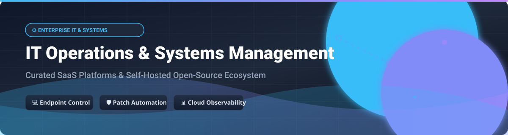

# Awesome IT Operations & Systems Management 🛠️⚡

  
  
  
  
  
  

## 🚀 Top IT Operations & Systems Management Ecosystem

**A Curated List of SaaS Products & Open-Source GitHub Projects for ITOM, Unified Endpoint Management (UEM), Remote Monitoring & Management (RMM), and Patch Automation**  

*Focused on Endpoint Management, Patch Automation, RMM, ITSM, CMDB, and Self-Hosted IT Operations*  

**Last updated: October 2026** 📅

Welcome to the **Awesome IT Operations & Systems Management** resource repository! This comprehensive guide tracks notable commercial **IT Operations Management (ITOM)** SaaS platforms and high-star **open-source infrastructure tools** that monitor, patch, configure, and secure endpoints and servers across hybrid multi-cloud environments — from cloud-managed enterprise device fleets to digital sovereign self-hosted automation stacks. 🌐💻

Contributions are warmly welcome! Please open a Pull Request (PR) to add or update entries. Keep descriptions factual and link directly to official project sites or repositories. 🤝

---

## 📑 Table of Contents

- [☁️ SaaS/Hosted Platforms](#️-saashosted-platforms)
- [🔓 Open-Source GitHub Projects](#-open-source-github-projects)
- [🤝 How to Contribute](#-how-to-contribute)
- [⚠️ Disclaimer](#️-disclaimer)
- [💖 Support & Sponsorship](#-support--sponsorship)
- [⭐ Star History](#-star-history)

---

## ☁️ SaaS/Hosted Platforms

> 📈 **Market Overview:** The global IT Operations Management (ITOM) market size is estimated at **$36B–$41B in 2026** (with the broader ITOM software & observability ecosystem exceeding **$50B+**). The market is **highly fragmented**, characterized by low concentration due to numerous specialized vendors in monitoring, RMM, ITSM, and patch automation competing alongside enterprise suites.

| SaaS Product 🏢 | Enterprise Size / Revenue / Valuation 💰 | Starting Tier Pricing 🏷️ | Free Tier / Free Trial Limits 🎁 | Key Features & Focus 🎯 |
| :--- | :--- | :--- | :--- | :--- |
| **[Microsoft Intune](https://www.microsoft.com/microsoft-intune)** | **$3.93 Trillion** Market Cap | **$8.00 / user / month** (Plan 1, annual) | **30-day free trial** (up to 25 licenses); bundled in M365 E3/E5/Business Premium | Cloud-based endpoint management, device configuration, compliance, and application deployment across Windows, macOS, iOS, Android, and Linux. |
| **[AWS Systems Manager](https://aws.amazon.com/systems-manager/)** | **$128.7 Billion** AWS Revenue (2025) | Core management features **$0 (Included with AWS)**; Automation **$0.0025 / step** | Core features (Run Command, Patch Manager, Session Manager) **free forever** for AWS nodes; **Parameter Store 20k free requests / month** | AWS unified operations platform to view, patch, and automate AWS and hybrid cloud infrastructure at scale. |
| **[ServiceNow ITOM](https://www.servicenow.com/products/it-operations-management.html)** | **$141.65 Billion** Market Cap (~$13.28B Revenue) | **~$0.50 – $1.50 / monitored node / month** (or ~$100–$200 / user / month for full suites) | **No public self-service trial** (Developer Instance available with execution rate limits) | Enterprise ITOM standard with AIOps event management, dynamic service mapping (CSDM), discovery, and change impact analysis. |
| **[Datadog](https://www.datadoghq.com/)** | **$99.0 Billion** Market Cap (~$3.43B Revenue) | **$15.00 / host / month** (Infrastructure, annual) | **14-day free trial** (Full feature access, unlimited hosts during trial); Free tier up to 5 hosts | Cloud observability and security platform providing infrastructure monitoring, APM, log management, and real-time alerting. |
| **[NinjaOne](https://www.ninjaone.com/)** | **$12.3 Billion** Valuation (~$600M ARR) | **~$1.50 – $3.75 / endpoint / month** (50-device minimum, billed annually) | **14-day free trial** (Full feature access) | Unified IT operations platform combining RMM, patch management, endpoint backup, and remote control in a single console. |
| **[Tanium Autonomous IT Platform](https://www.tanium.com/)** | **$9.0 Billion** Valuation (~$700M ARR) | **~$2.00 – $5.00 / endpoint / month** (Enterprise custom quote) | **No public free trial** (Guided POC / Demo available upon request) | Real-time endpoint management and security powered by Linear Chain Architecture querying millions of endpoints peer-to-peer in seconds. |
| **[Ivanti Neurons](https://www.ivanti.com/)** | **~$2.0 Billion** Valuation (~$690M Revenue) | **~$90.00 / device / year** (~$7.50 / device / month) | **No public self-service free trial** (Sales demo / POC on request) | ITSM and Unified Endpoint Management (UEM) offering service catalog automation, asset management, and endpoint self-healing. |
| **[Automox](https://www.automox.com/)** | **$666 Million** Valuation (~$50M–$73M Revenue) | **$1.00 / endpoint / month** (Patch OS, annual commitment) | **15-day free trial** (Unlimited endpoints during trial) | Cloud-native IT patch automation platform for Windows, macOS, and Linux patching 630+ third-party applications without VPN. |

---

## 🔓 Open-Source GitHub Projects

Below is a curated list of top open-source IT operations, monitoring, endpoint management, remote access, and configuration automation tools sorted by GitHub Stars_Count. ✨

| Project 📦 | GitHub_Stars ⭐ | Description & Key Focus 🛠️ |
| :--- | :--- | :--- |
| **[Ansible](https://github.com/ansible/ansible)** |  | **Agentless IT automation & configuration management** standard (GPL-3.0). Automates system provisioning, app deployment, and configuration state preservation across large infrastructure fleets. |
| **[etcd](https://github.com/etcd-io/etcd)** |  | **Distributed reliable key-value store** (Apache-2.0). Provides strongly consistent configuration state management and service discovery for distributed systems and Kubernetes clusters. |
| **[1Panel](https://github.com/1Panel-dev/1Panel)** |  | **Modern open-source Linux server management panel** (GPL-3.0). Provides a web-based GUI for container management (Docker), web site deployment, database management, and system monitoring. |
| **[Consul](https://github.com/hashicorp/consul)** |  | **Service networking & configuration platform** (BSL-1.1). Enables service discovery, health checking, traffic management, and automated network security policy enforcement across multi-cloud environments. |
| **[Cockpit](https://github.com/cockpit-project/cockpit)** |  | **Web-based graphical interface for Linux servers** (LGPL-2.1). Allows sysadmins to manage storage, inspect logs, configure network settings, manage containers, and control systemd services in a browser. |
| **[Puppet](https://github.com/puppetlabs/puppet)** |  | **Infrastructure as Code and configuration management engine** (Apache-2.0). Enforces desired system states automatically across enterprise node fleets. |
| **[MeshCentral](https://github.com/Ylianst/MeshCentral)** |  | **Complete web-based remote monitoring and management platform** (Apache-2.0). Provides remote desktop control, terminal access, file transfer, and Wake-on-LAN for Windows, macOS, Linux, and mobile devices. |
| **[GLPI](https://github.com/glpi-project/glpi)** |  | **Free Asset and IT Management Software package** (GPL-3.0). Features an ITIL Service Desk, license tracking, software auditing, financial tracking, and a self-service portal. |
| **[pfSense CE](https://github.com/pfsense/pfsense)** |  | **Free open-source firewall & router distribution** based on FreeBSD (Apache-2.0). Features traffic shaping, VPN gateway capabilities, stateful inspection, and web console management. |
| **[OPNsense](https://github.com/opnsense/core)** |  | **Hardened FreeBSD-based security and firewall platform** (BSD-2-Clause). Includes inline intrusion prevention, VPN server support, traffic management, and modern UI. |
| **[defguard](https://github.com/DefGuard/defguard)** |  | **Enterprise WireGuard VPN & Identity Provider** (Apache-2.0). Combines secure remote network access with multi-factor authentication (MFA/2FA), SSO, and desktop/mobile client management. |
| **[Zabbix](https://github.com/zabbix/zabbix)** |  | **Enterprise-class open-source monitoring platform** (GPL-2.0). Provides real-time network, server, virtual machine, container, and cloud service monitoring with threshold alerting and visualization. |
| **[iTop](https://github.com/Combodo/iTop)** |  | **ITIL web-based service management & CMDB tool** (AGPL-3.0). Connects applications, middleware, hardware, and networks in a connected topology graph with impact analysis. |
| **[OpenUEM](https://github.com/open-uem/openuem-console)** |  | **Self-hosted Unified Endpoint Manager** (Apache-2.0). Manages IT asset inventories, deploys software (WinGet/Flatpak), and delivers remote desktop assistance for Windows and Linux fleets. |
| **[OCO-Agent](https://github.com/schorschii/oco-agent)** |  | **Self-hosted desktop & server inventory and deployment agent** (GPL-3.0). Handles policy management, logon overview, and cross-platform endpoint orchestration. |
| **[Sentinella](https://pypi.org/project/sentinella-monitor/)** | N/A (PyPI package) | **Cross-platform system monitor with TUI & web dashboard** (MIT). Monitors host CPU, RAM, disk, network, and Docker/LXC containers over secure WebSockets. |

---

## 🤝 How to Contribute

1. **Fork** the repository. 🍴
2. **Add/edit** entries in `README.md` following the tabular format. 📝
3. **Include**: name, official link, detailed description, pricing/licensing, and key features. 🔍
4. **Submit a Pull Request (PR)** with a clear explanation of your additions. 🚀

If you find this list helpful, please consider **starring 🌟** the repository to support the project and help others discover it!

---

## ⚠️ Disclaimer

- This is a **community-curated** resource list for educational and technical reference purposes.
- IT operations platforms handle privileged infrastructure access. Self-hosted solutions require proper security hardening, firewalls, role-based access control (RBAC), and compliance auditing.
- **Open-source responsibility**: Managing self-hosted tools requires dedicated operational resources for hosting, database maintenance, and security updates.
- **License compliance**: Always check specific software licenses (GPL, Apache-2.0, BSL, AGPL) prior to enterprise deployment.

---

## 💖 Support & Sponsorship

Thank you for exploring and using **Awesome IT Operations & Systems Management**! 💙

If this project has saved you time or helped in your systems architecture design:
- 🌟 **Star** this repository on GitHub.
- 🔄 **Share** it with fellow system administrators, DevOps engineers, and IT operations teams.
- ☕ **Sponsor** the project or buy us a coffee via [GitHub Sponsors](https://github.com/sponsors/ishandutta2007).

Your support keeps this curated ecosystem up-to-date and thriving! 🙌

---

## ⭐ Star History

---

**Made with ❤️ for system administrators, IT operations engineers, and open-source advocates.**  
*Empowering transparent, sovereign, and automated IT operations worldwide.* ✨
